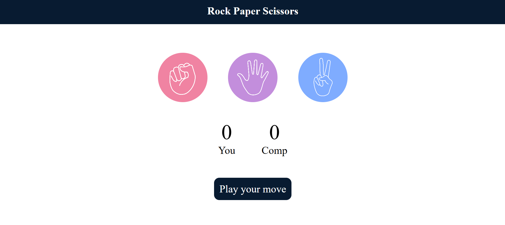

# ✊🖐✌️ Rock Paper Scissors Game

A classic Rock Paper Scissors game built using **HTML**, **CSS**, and **JavaScript**. This project helped me strengthen key JavaScript concepts such as conditional logic, DOM manipulation, and event handling.

🔗 **Live Demo:** [Click Here](https://rock-paper-scissors-game-vjgm-git-main-hemant2871s-projects.vercel.app)

## ✨ Features

- 🎮 Single player mode vs computer
- 🤖 Random computer moves
- 📊 Score tracking
- 🔁 Play again functionality
- ⚡ Fast and responsive UI

## 🛠️ Tech Stack

- **Frontend:** HTML, CSS, JavaScript
- **Deployment:** Vercel

## 📁 Folder Structure

```
rock-paper-scissors-game/
├── index.html
├── style.css
├── script.js
├── README.md
└── image1.png
```


## 🚀 How to Run Locally

1. Clone the repository:
   ```bash
   git clone https://github.com/hemant2871/rock-paper-scissors-game.git
   cd rock-paper-scissors-game
2. Open index.html in your browser.
   

  ### 📚 What I Learned
Applied conditional logic to build game outcomes

Implemented dynamic DOM updates

Improved JavaScript interaction and event handling

Gained hands-on experience with user interaction flow

###📬 Contact
Feel free to connect with me:

🔗 [GitHub](https://github.com/hemant2871)

💼 [LinkedIn](http://www.linkedin.com/in/hemant-sharma-3135b4290)


